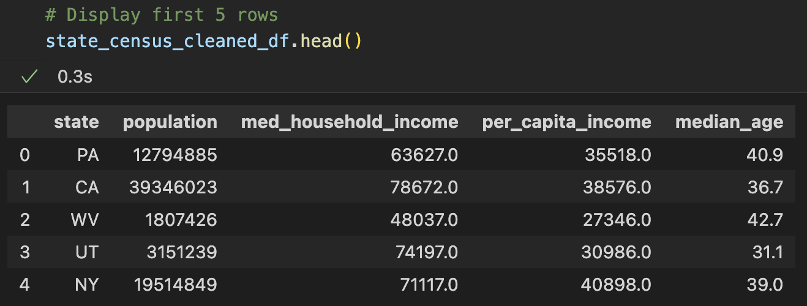
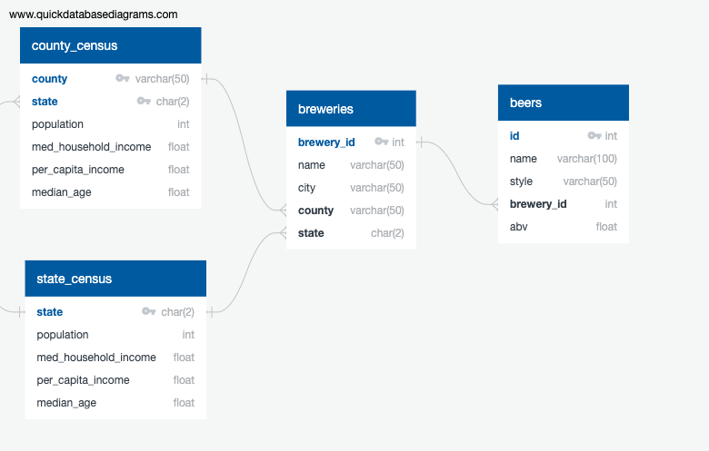

# Craft Beer and Brewery Locations in the U.S.: Extract, Transform, and Load Project
### Glen Dagger
### Chris Schultz

### Quick Links
- [Project Overview](#overview)
- [Extract](#extract)
- [Transform](#transform)
- [Load](#load)

 

# Project Overview

- Our project gathers data on craft beers and breweries in the United States, as well as U.S. Census data, for potential future analysis on craft beers and the location of breweries in the United States with respect to several chosen census metrics.
- Software: Python, Jupyter Notebook, Google Chrome DevTools, pgAdmin
- Python Libraries: Pandas, US Census Python wrapper, SQLAlchemy, Selenium WebDriver

Most of our work was completed in the [ETF.ipynb](ETL.ipynb) Jupyter Notebook file. We included all web-scraping coding in the [county_web_scrape.py](county_web_scrape.py) file, which was called in the primary notebook.

 

# Extract

Our data was extracted from the following sources:
- [US Census API (ACS5 from 2020)](https://pypi.org/project/CensusData/)
  - Used the Census Python wrapper for the US Census API to retrieve some state demographic metrics from the American Community Survey Data (ACS5 for 2020).
- [Kaggle - Craft Beers Dataset](https://www.kaggle.com/datasets/nickhould/craft-cans?select=breweries.csv)
  - Both csv files stored locally (not in repository) due to GitHub size limits
  - Used Pandas read_csv function to read in <em>[beers.csv]</em> and <em>breweries.csv</em>.
- [StatsAmerica City-to-Country Finder](https://www.statsamerica.org/CityCountyFinder/) - web scraping county names for city/state values
  - Within the [county_web_scrape.py](county_web_scrape.py) file, we used Selenium WebDriver to scrape the website and find the corresponding county for all county/state pairs.
  - Grouped breweries dataframe by county, state and filtered resulting dataframe, 'city_df', to only those two columns in order to get a unique list.
  - Looped through each row of 'city_df' dataframe and using Selenium, automated selecting the state from the dropdown and entering the city in the input field for each row.
  - Shifted the WebDriver to the new window and scraped resulting table for "County" value.
  - Reformatted "County" value from "County, State" to "County" and appended to empty list, leaving that position blank if county not found.
  - Combined new county list with 'city_df' and exported resulting dataframe as 'county_df.csv'.
  - We called 'county_web_scrape.county_scrape()' in the Breweries section of the main Jupyter Notebook (commented out since we only needed to perform this once and save results to [county_df.csv](./Resources/county_df.csv) in Resources subdirectory.

 

# Transform

After extracting all of our data, the following steps were performed to transform it into the desired cleaned tables. We prepared our data by ensuring our relations were in Third Normal Form (3NF).

## County and State Census Data

- We used the Census Python wrapper for the US Census API to retrieve some county and state demographic metrics from the American Community Survey Data (ACS5) for 2020. This was used to create the initial dataframe 'county_census_data', and a similar one for 'state_census_data':
. The API key is stored in the [config.py](config.py) file and imported into the Jupyter Notebook.

- In order to clean the county census data, we performed the following actions:
  - Renamed columns for readability.
  - Cast population column from floats to integers.
  - Split county column into separate <strong>county</strong> and <strong>state</strong> columns.
  - Using a dictionary with full state names as keys and state abbreviations as values, converted the <strong>name</strong> column to state abbreviations to match breweries data set.
  - Dropped <strong>county_code</strong> and <strong>state_code</strong> columns.
  -   - The end result was our cleaned dataframe 'county_census_final_df':

- In order to clean the state census data, we performed the following actions:
  - Renamed columns for readability.
  - Dropped <strong>state_code</strong> column and replaced it with new <strong>state</strong> column with state names.
  - Using a dictionary with full state names as keys and state abbreviations as values, converted the <strong>state</strong> column to state abbreviations to match breweries data set.

- The end result was our cleaned dataframe 'state_census_cleaned_df', which we also exported as a csv file to the 'CleanedCSVs' subdirectory to inspect it more easily:

 
## Beers Dataset

- Using Pandas to read in the <em>beers.csv</em> file, we created the initial dataframe 'beers_df':

- In order to clean this data, we performed the following actions:
  - Filtered down to only include <strong>id</strong>, <strong>name</strong>, <strong>style</strong>, <strong>brewery_id</strong>, and <strong>abv</strong> columns.
  - Reordered columns.
  
- The end result was our cleaned dataframe 'beers_cleaned_df':

 

## Breweries Dataset

- Using Pandas to read in the <em>breweries.csv</em> file, we created the initial dataframe 'breweries_df':

- In order to clean this data, we performed the following actions:
  - Stripped whitespace from <strong>name</strong> and <strong>state</strong> columns.
  - Renamed <strong>Unnamed: 0</strong> column as <strong>brewery_id</strong>.

- We later realized that the Census API does not provide data for specific cities as we had initially planned. We did not have the county data for each brewery's location, so we used a county finder website found online as our source. We scraped the county data for each brewery as detailed in the [Extract](#extract) section, above.
- The end result was our cleaned dataframe 'breweries_final_df':

 

## Mismatched County Names
- We later realized due to foreign key violations in the database that there were county names in the breweries table that did not match any county names in the census. Suspecting that this was due to differences in labelling rather than missing information in the census, we corrected the mismatched county names as follows:
  - Concatenated unique county/state rows from 'breweries_final_df' and 'county_census_cleaned_df' to identify potentially mismatched county names.
  - Filtered down to only rows from breweries dataset that did not match any county names form census
  - Since only 9 county names needed to be adjusted due to differences in county name labeling, it was simple to manually create a dictionary to replace mismatched county names in 'breweries_final_df'. This ensured all county names matched (though not all breweries have county information).

 

# Load

We decided to use the relational database PostgreSQL since we had relationships between each of our final tables that we wanted to reference. We used the following Entity Relationship Diagram to sketch out our tables and their primary/foreign keys:

- In pgAdmin, we created the table schema for our database and saved it as [beer_queries.sql](/beer_queries.sql).
- Using SQLAlchemy, we created a connection to the PostgreSQL database and used the inspector to verify the tables were created:

- Then we used the to_sql function to export each dataframe in the Jupyter notebook to the corresponding table in the PostgreSQL database. The order in which we added data to the tables was state, county, breweries, then beers.
- Selected the first 10 rows of all columns in each table to verify:

